# Devices and IOT Class 2

---
### Create a traffic light controller with pedestrian cross walk touch button using Scratch for Arduino <br>Download and install mBlock IDE. <br>Use the mBlock IDE to create an Arduino native C program that slowly increases and decreases the brightness of an LED and allows a touch button to interrupt the cycle.<br>Modify the LED slow blink program to recreate the Traffic Light Controller with Pedestrian Touch Button using mBlock to create a stand alone version which reports the cycle timing on its serial port.

# Traffic Light Controller

### Lets setup the Arduino Mega2560 board with Grove Shield for the traffic light controller with pedestrian crosswalk button project.

### Connect the red LED to Grove socket D6-D7, the yellow LED to D10-D11 and green LED to D12-D13 and the touch button to D2-D2 an Arduino MEGA2560 with Seeed Studio Grove shield.
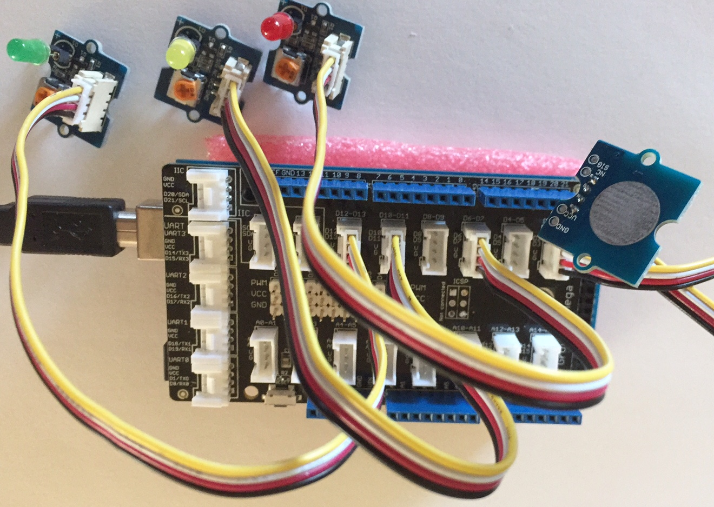

### Launch the S4A application and create the the program using Scratch drag-and-drop programming as depicted below. Be sure to select the correct pin number for each digital or analog device. Due to limitations of S4A this project uses the digital PWM pin 6, which is called an analog device, and sets it to full on with a PWM value of 255, or full off with a PWM value of 0.
### Pulse Width Modulation (PWM) uses 10,000 cycles or more per second of variable length pulses that when aggregated (think calculus integrals), can vary the aggregate power supplied to an LED or other device creating the effect of dimming an LED, or slowing a DC motor. In our next project we will use the PWM capability to make an LED slowly glow brighter and dimmer in a slow cycle. Press the flag icon to run the Scratch program.

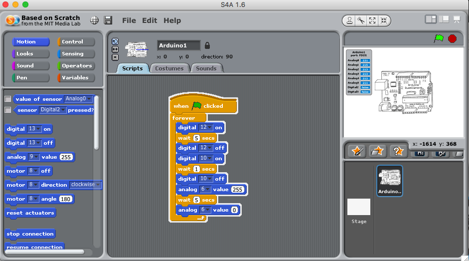

### Now that you've coded the basic 3 light cycles of a traffic light, lets add a pedestrian cross walk touch button code. Replace the "wait 5 secs" block with a "reset timer" and "wait until" block with the condition being a "greater than" comparison block with "timer" on the left and the number 5 on the right. This is the equivalent of a "wait 5" block, but allows us to add more conditions to the delay. Test that it works then add an "or" block and a "sensor Digital2 pressed?" block. Press the green flag to run the Scratch program and then try touching the pedestrian button at various moments.

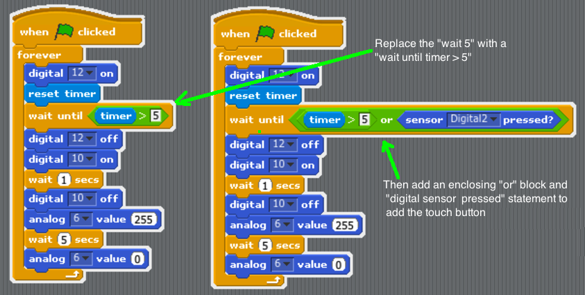

### Touching the pedestrian button causes the traffic light to immediately switch the a yellow light state. The video below is sped up 5 x 


# Download and install mBlock IDE

### Go to the mBlock.cc web site and start downloading mBlock for your Mac. Once mBlock is downloaded copy it to your Applications folder to install it.

### S4A is a great program that allows PC's, Mac's and Raspberry Pi's to create interactive Scratch user interfaces that control and respond to an attached Arduino Mega 2560 microcontroller. Many projects just want to be a stand-alone Arduino project that does not require another computer running Scratch as the controller. mBlock allows us to write Scratch programs using drag-and-drop block coding, which mBlock uses to write native C/C++ code that we then compile with the Arduino IDE that runs stand-alone. mBlock can function like S4A using USB control firmware like "S4AFirmware.ino", but most important for us is that it includes an awesome transpiler to show us how to write C/C++ Arduino code based on Scratch block coding.

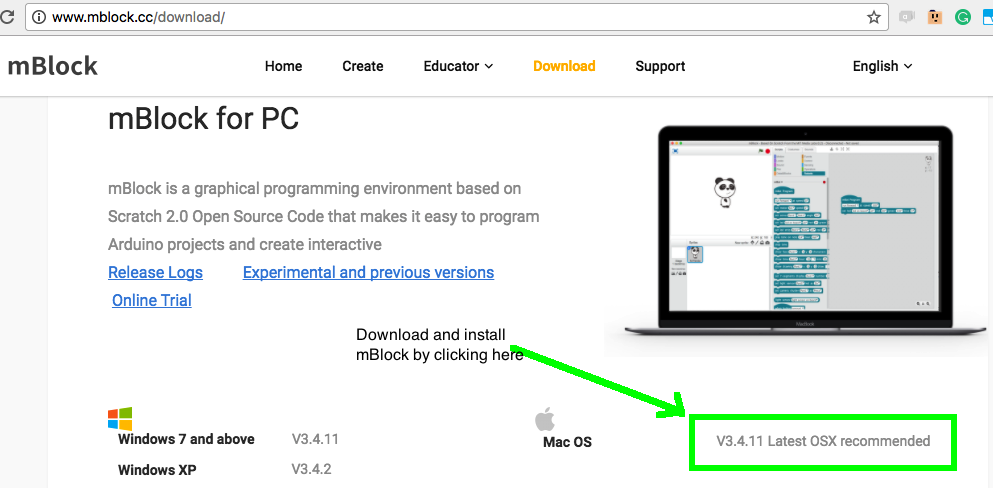

##### The first time you launch S4A and other apps like the Arduino IDE and mBlock. you will likely have to go into yoru Mac's Security and Privacy settings dialog and launch it using the "Open Anyway" button
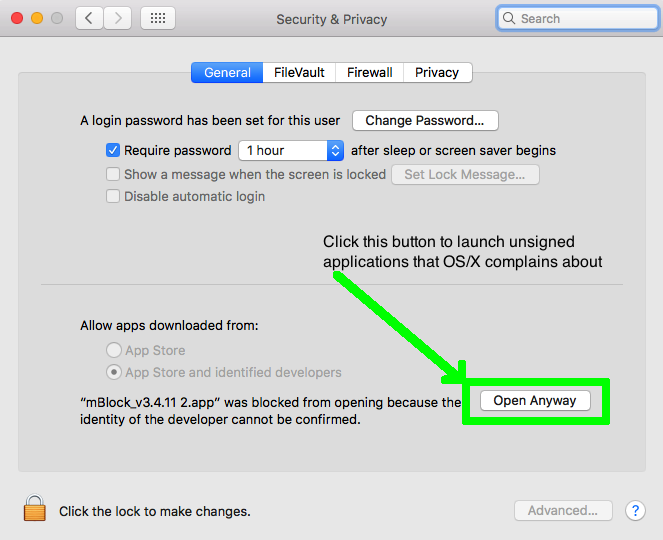


### mBlock opens with a familiar Scratch interface of an avatar in an animation window and Scratch code blocks.
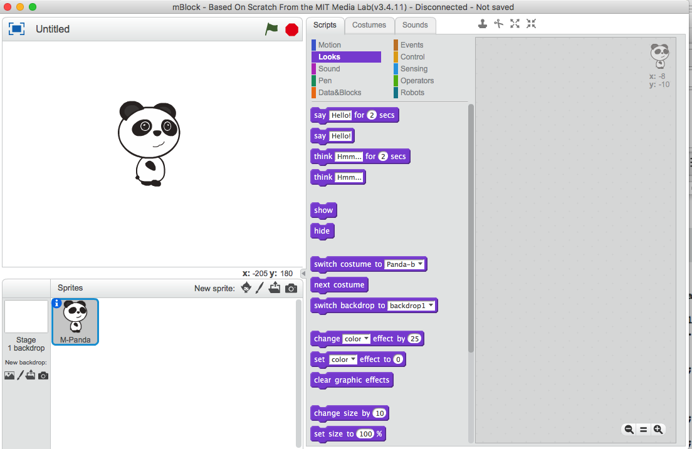

### Select the Arduino Mega 2560 board fromteh Boards menu.
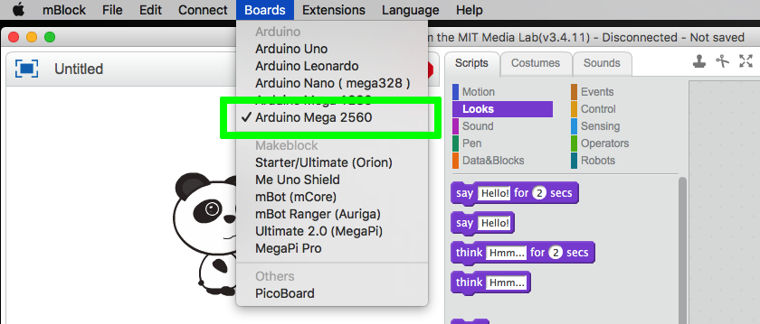

### Plug the Mega 2560 boards USB cable into your Mac. Select and click the Connect menu and then Arduino Mega 2560 boards USB port.  In my case the port is /dev/tty.usbmodemFD141. Your port it will be similar but different. Make sure a check mark appears to the left of the port name.


### Now switch mBlock into Arduino mode using the Edit menu and then the Arduino Mode selection. This open the C/C++ code output subwindow and close the stage layout subwindow.
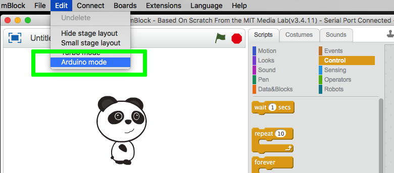
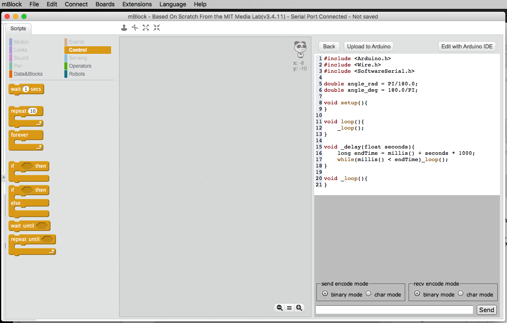

### Create the Scratch code program below to create a slowly brightening and dimming LED with touch interruption of the brightening phase. While dragging and dropping Control, Operators and Robots blocks, you will need to refer to two variables you need to make using the Data&Blocks capabilities. Create two variables, "brightness" and "startTime" so you can use them while customizing other blocks.
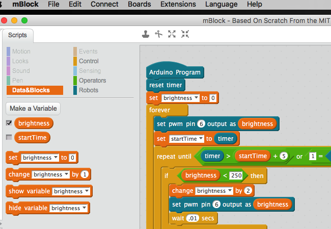

### Create the program below using various blocks starting with the Arduino Program block. As you create the Scratch code, watch how mBlock writes the equivalent C/C++ Arduino compatible code for you. I suggest studying the C/C++ code generated and see how the Scratch code blocks create C/C++ code sections. Using mBlock coding and transpilation is a good way to learn the C/C++ language. I suggest studying the first half of the first 2 classes of the [IOT-3-CPP-and-Devices](https://product-college-courses.github.io/IOT-3-C-CPP-and-Devices/ClassIndex.html) just to familiarize yourself with basic C programming constructs.

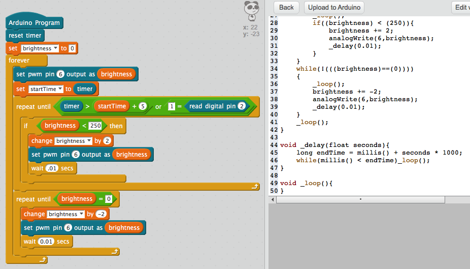

### Once you have the program written, it is tempting to use the "Upload to Arduino" or the "Edit with Arduino IDE" buttons, but don't do that as mBlock includes a very outdated version of the Arduino IDE in it's application bundle. Instead use the cursor to select the entire C/C++ code text and then open the Arduino IDE you installed. Create a new sketch window and delete the default code in the window. Paste the mBlock created code into the Arduino code window and then compile and upload it. Save the mBlock project and the Arduino Sketch files with meaningful files names like "SlowBlinkWithTouch".
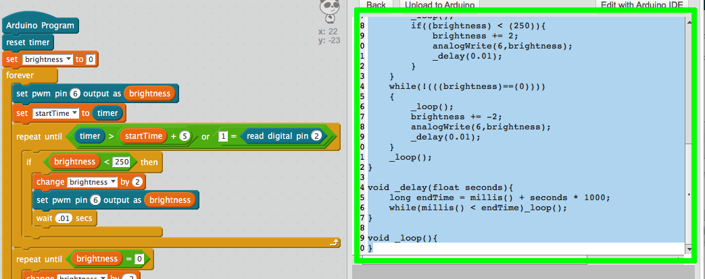
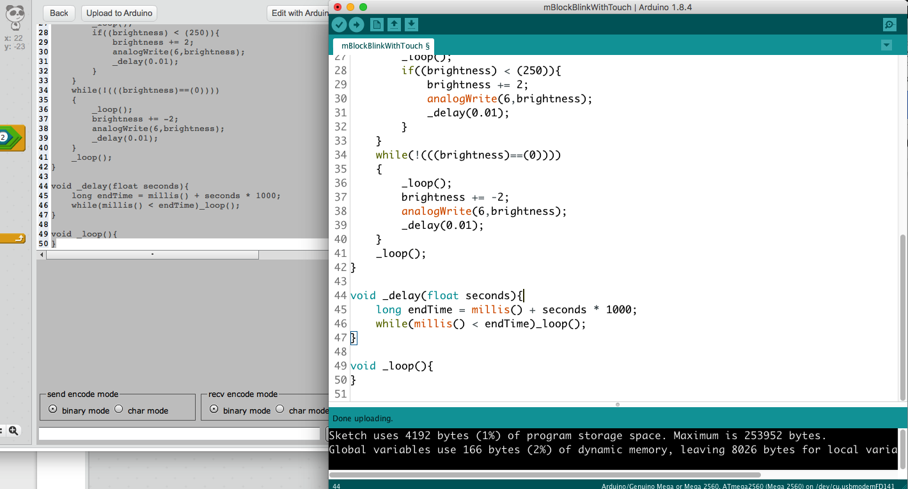

### This is the code that mBlock should create. 

```c
#include <Arduino.h>
#include <Wire.h>
#include <SoftwareSerial.h>

double angle_rad = PI/180.0;
double angle_deg = 180.0/PI;
double brightness;
double startTime;
double currentTime = 0;
double lastTime = 0;
double getLastTime(){
      return currentTime = millis()/1000.0 - lastTime;
}

void setup(){
    lastTime = millis()/1000.0;
    brightness = 0;
    pinMode(6,OUTPUT);
    pinMode(2,INPUT);
}

void loop(){
    analogWrite(6,brightness);
    startTime = getLastTime();
    while(!(((getLastTime()) > ((startTime) + (5))) || (((1)==(digitalRead(2))))))
    {
        _loop();
        if((brightness) < (250)){
            brightness += 2;
            analogWrite(6,brightness);
            _delay(0.01);
        }
    }
    while(!(((brightness)==(0))))
    {
        _loop();
        brightness += -2;
        analogWrite(6,brightness);
        _delay(0.01);
    }
    _loop();
}

void _delay(float seconds){
    long endTime = millis() + seconds * 1000;
    while(millis() < endTime)_loop();
}

void _loop(){
}
```
### Lets modify the SlowBlinkWithTouch Scratch code to function like the traffic light controller code we created with S4A. Before starting to change the program, from mBlocks File menu, select "Save Project As" and choose a new file name like "mBlockTrafficLight". Then from the Arduino IDE, create a new Sketch window to paste the traffic light code into. Notice that the code below uses a new feature of Scratch called "define Subroutine" which writes the "startTime" value to the Arduino Serial Console at the end of each red light transitionto green light. It uses a Baud rate of 115200 in the Arduino Serial Console, so make sure that is set properly. For me, the console read 0.0, 14.0, 28.0 and so on as the light cycled. Touching the pedestrian button will change the timing reported on the serial console. In future coding projects, you will use the serial console for multiple purposes, from debugging a program to having your Arduino program communicate with another computer using the USB serial interface.


### The final project in the class is a true IOT project where the Arduino Mega 2560 will communicate with the MAC over USB to a Python program acting as a web server, allowing a browser to control the Arduino.

